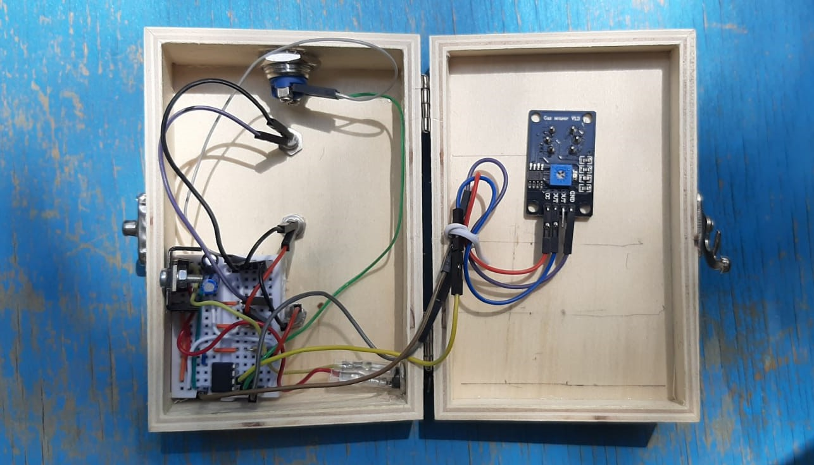
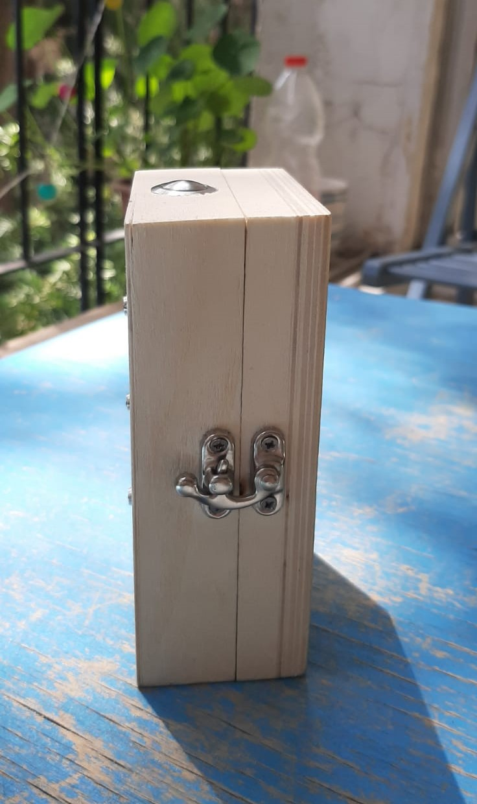
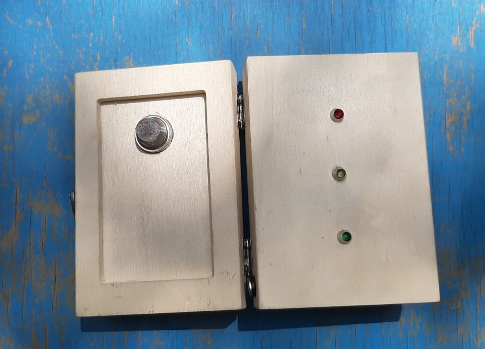
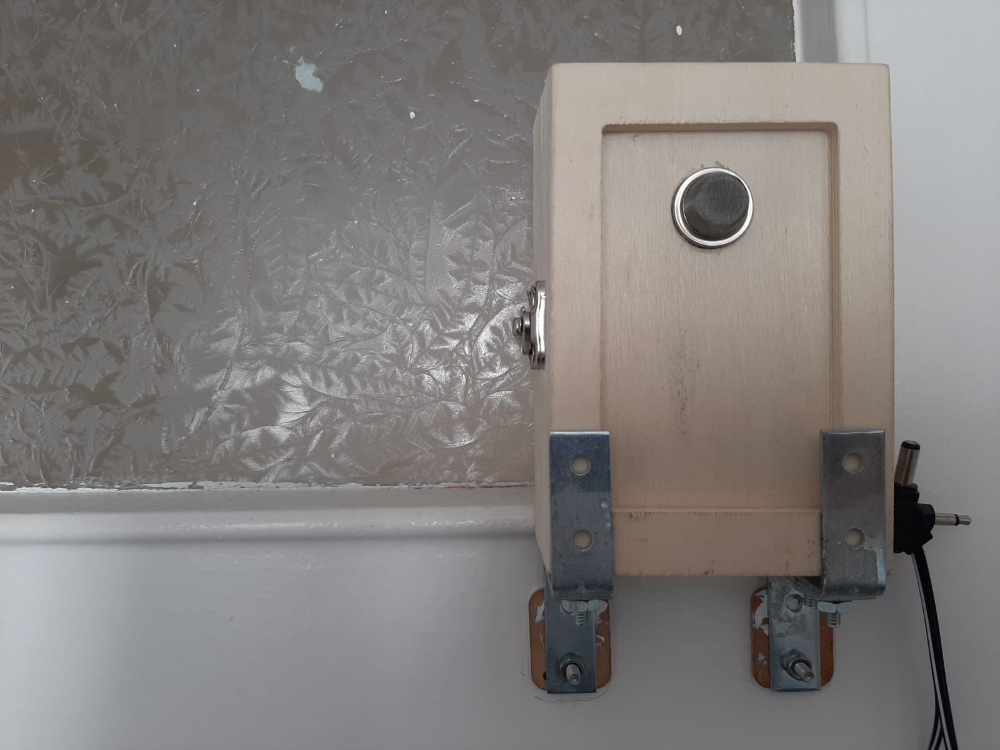

# Bad Smells Detector
    

### Description:
A real-time indicator for bed smells which has 3 states:
1. Green
2. Orange
3. Red

When it's Red, you don't want to go to the bathroom...

### Calibration:
1. **short** press on the button defines the value for a "good" smell
2. **long press** defines "bad" smell.
3. **10 sec press** will go back to default.

### Consist of:
- 1 Microcontroller: [PIC12F683](https://ww1.microchip.com/downloads/en/devicedoc/41211d_.pdf)
- 1 Methan gas sensor: [MQ4](https://www.sparkfun.com/datasheets/Sensors/Biometric/MQ-4.pdf)
- 1 Push Button
- 1 Regulator: [L7805](https://www.st.com/resource/en/datasheet/l78.pdf)
- 1 Matrix
- 3 Leds (Green, Oragne, Red)
- capacitors, resistors and wires
- programmer: [PIC Programmer K150](https://www.ebay.com/itm/PIC-Programmer-K150-USB-Automatic-Microchip-Develop-Microcontroller-ICSP-Cable/252710962515?hash=item3ad6bf4553:g:rG4AAOSw2xRYbh9x) 

#### Software:
- programmer software: `DIY K150 PICmicro Programmer v150807` 
- IDE: `MPLAB X IDE V5.25 by Microchip (XC8)`

### Result:

